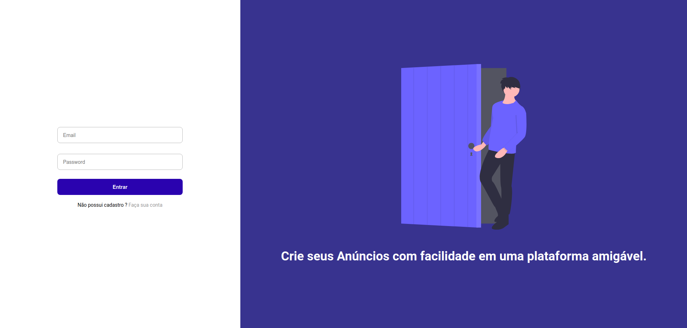
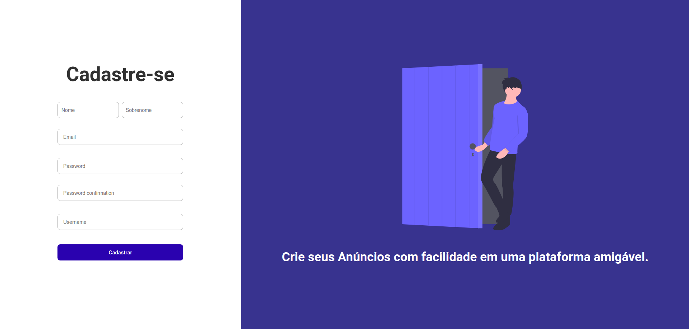

# Sobre

Aplicação criada totalmente para fins de estudo, baseada na aplicação de anuncios Olx.
Maior parte do desenvolvimento foi feito em live em meu canal da Twitch: https://www.twitch.tv/morninnsun

# Tecnologias

Criada somente com Javascript utilizando a Stack NodeJs e ReactJs.

# Como Executar 

Em uma pasta de sua escolha, rode o comando "git clone https://github.com/Angells1/MySpotsApp.git".
Após isso, entre nas pastas: web e backend e rode o comando "npm install" em ambas para instalar todas as dependencias. Por fim para executar o backend, entre na pasta do mesmo e execute "yarn dev".
Para o frontend, entre na pasta web e execute "yarn start". Altere o nome do arquivo .env.example na pasta backend para .env, e coloque as informações requeridas.

Autor: Gabriel Angelo.
